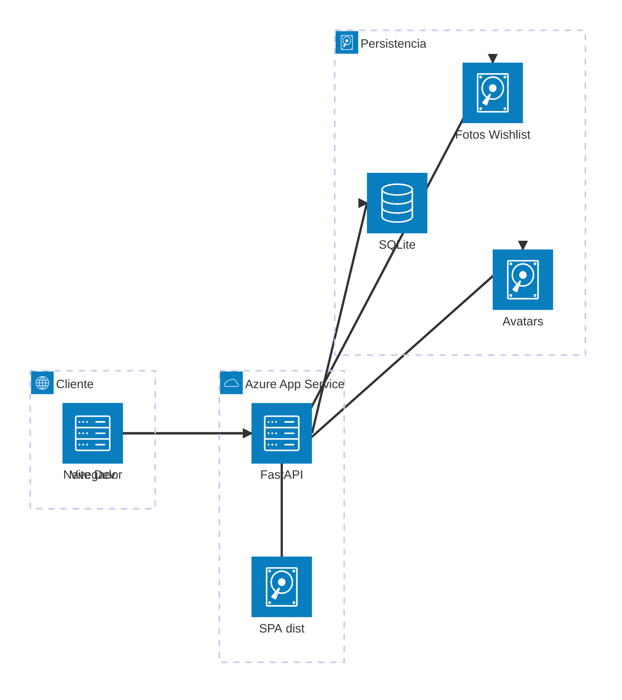
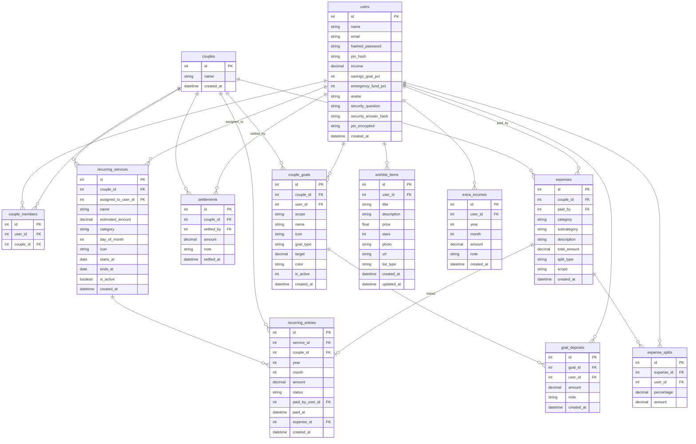
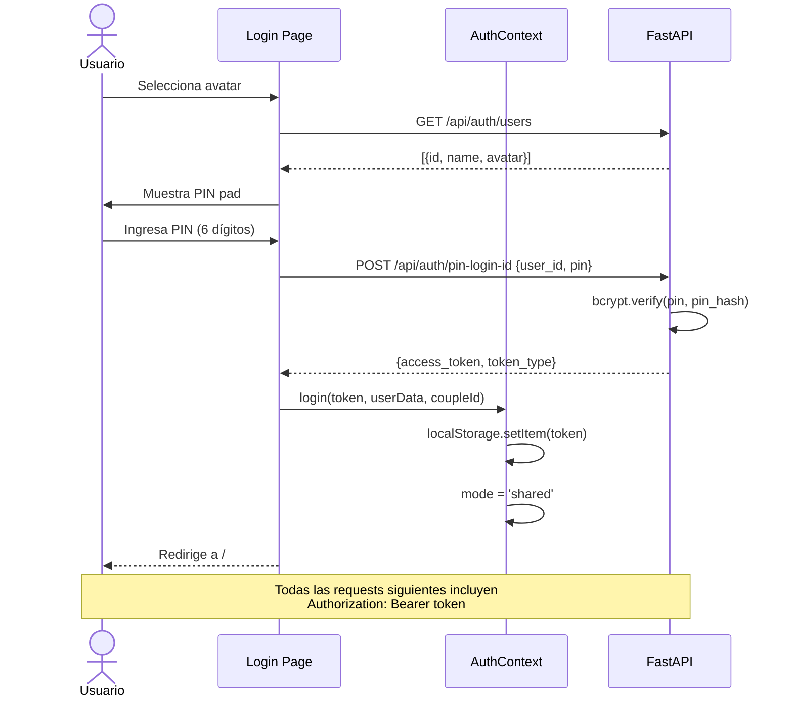
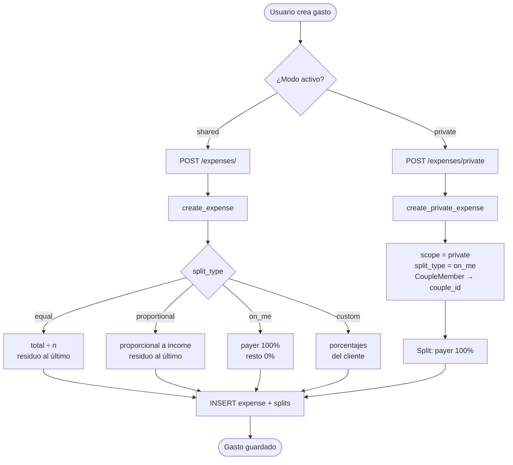
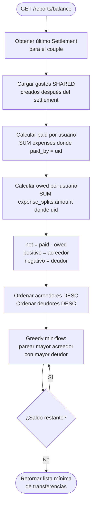
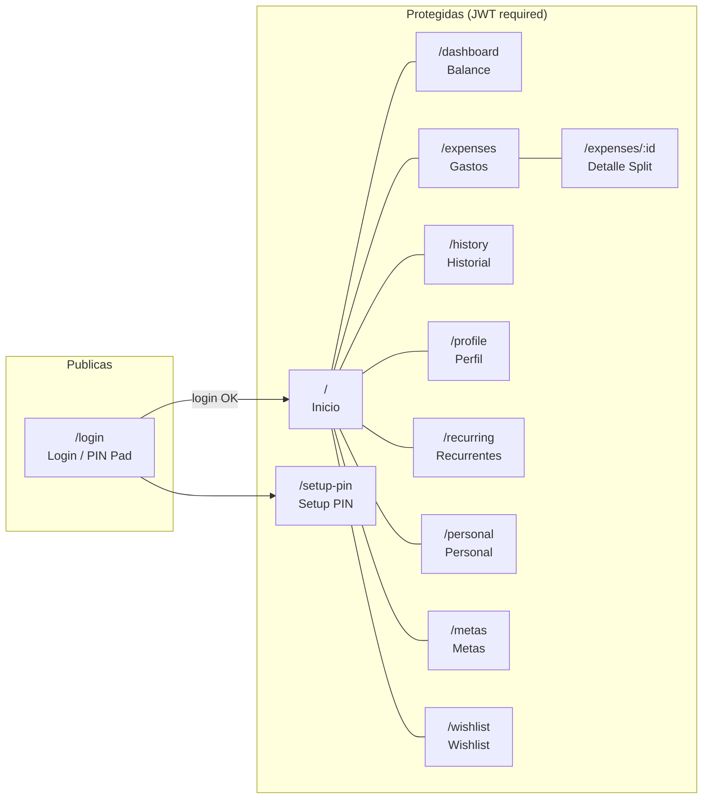

# Cohabit Finance

Aplicación de finanzas compartidas para parejas. Permite registrar gastos, calcular balances, manejar metas de ahorro, gastos recurrentes y una lista de deseos personal — todo desde un único stack Python + React.

---

## Tabla de Contenidos

- [Stack tecnológico](#stack-tecnológico)
- [Arquitectura del sistema](#arquitectura-del-sistema)
- [Estructura del proyecto](#estructura-del-proyecto)
- [Base de datos — Modelo relacional](#base-de-datos--modelo-relacional)
- [Autenticación — Flujo de secuencia](#autenticación--flujo-de-secuencia)
- [API Reference](#api-reference)
- [Lógica de negocio](#lógica-de-negocio)
  - [Creación de gastos](#creación-de-gastos)
  - [Cálculo de balance](#cálculo-de-balance)
  - [Tracker personal](#tracker-personal)
  - [Wishlist](#wishlist)
  - [Recurrentes](#recurrentes)
- [Frontend — Routing](#frontend--routing)
- [Gestión de modo (Compartido / Personal)](#gestión-de-modo-compartido--personal)
- [Desarrollo local](#desarrollo-local)
- [Despliegue en Azure](#despliegue-en-azure)
- [Persistencia de datos](#persistencia-de-datos)

---

## Stack tecnológico

| Capa | Tecnología |
|---|---|
| Backend | Python 3.11+, FastAPI, SQLAlchemy (SQLite), Pydantic v2, bcrypt, PyJWT, Pillow, openpyxl |
| Frontend | React 18, Vite 6, Tailwind CSS, React Router v6, Axios |
| Base de datos | SQLite (archivo `app.db`) — sin servidor, desplegable en cualquier VPS/PaaS |
| Hosting | Azure App Service (Linux) |
| Auth | PIN de 6 dígitos (bcrypt) + JWT HS256 con expiración de 6 meses |

---

## Arquitectura del sistema



### Cómo funciona en producción

1. El build de Vite genera `backend/frontend/dist/`.
2. FastAPI sirve los assets estáticos en `/assets` y hace catch-all de toda ruta no-`api/` devolviendo `index.html` (SPA routing).
3. Las llamadas a `/api/*`, `/avatars/*` y `/wishlist-photos/*` son manejadas por FastAPI directamente.
4. Los datos persisten en `/home/data/` del App Service (disco persistente de Azure).

### Cómo funciona en desarrollo

- Vite corre en `:5173` y hace proxy de `/api`, `/avatars` y `/wishlist-photos` hacia `localhost:8000`.
- El backend corre con `--reload` en `:8000`.
- `scripts/dev.sh` levanta ambos procesos con un solo comando.

---

## Estructura del proyecto

```
cohabit-finance/
├── deploy.sh                    # Despliegue interactivo a Azure App Service
├── scripts/
│   ├── dev.sh                   # Inicia backend + frontend en modo desarrollo
│   └── build.sh                 # Build de frontend + arranque en modo producción
├── backend/
│   ├── main.py                  # Factory de FastAPI: CORS, routers, SPA serving, startup
│   ├── requirements.txt
│   ├── startup.sh               # Script de arranque para Azure App Service
│   ├── app/
│   │   ├── api/                 # Routers FastAPI (un archivo por dominio)
│   │   │   ├── auth.py          # Login, PIN, recuperación por pregunta de seguridad
│   │   │   ├── users.py         # Perfil, avatar, PIN, ingresos extra, pregunta de seguridad
│   │   │   ├── expenses.py      # CRUD de gastos (compartidos y privados)
│   │   │   ├── reports.py       # Balance, historial, tracker personal, exportación Excel
│   │   │   ├── settlements.py   # Registro de liquidaciones
│   │   │   ├── goals.py         # Metas de ahorro/emergencia (shared/private)
│   │   │   ├── recurring.py     # Servicios recurrentes y entradas mensuales
│   │   │   └── wishlist.py      # Lista de deseos con fotos
│   │   ├── core/
│   │   │   ├── config.py        # Settings (pydantic-settings): JWT, DB URL
│   │   │   └── security.py      # bcrypt, JWT, Fernet (cifrado PIN para recuperación)
│   │   ├── dependencies/
│   │   │   └── auth.py          # get_db, get_current_user (OAuth2 Bearer)
│   │   ├── models/              # Modelos SQLAlchemy
│   │   └── schemas/             # Schemas Pydantic (request/response)
│   ├── services/
│   │   ├── balance_service.py   # Cálculo de deudas + simplificación greedy
│   │   ├── expense_service.py   # Lógica de splits, CRUD, privados
│   │   └── report_service.py    # Informes mensuales, tracker, exportación XLSX
│   └── db/
│       ├── session.py           # Engine SQLAlchemy, SessionLocal, Base
│       └── init_db.py           # create_all + migraciones manuales + seed demo
└── frontend/
    ├── vite.config.js           # Proxy dev → :8000, outDir → backend/frontend/dist
    └── src/
        ├── App.jsx              # Router + ProtectedRoute + AppShell
        ├── context/
        │   └── AuthContext.jsx  # Estado global: user, coupleId, mode
        ├── services/
        │   └── api.js           # Instancia Axios + todas las funciones de API
        ├── pages/               # 13 páginas
        └── components/          # Navbar, ExpenseForm, PinPad, StarRating, WishlistItemModal
```

---

## Base de datos — Modelo relacional



### Notas del modelo

- `expenses.scope`: `"shared"` (visible a la pareja, incluido en balances) | `"private"` (solo el dueño, excluido de balances).
- `expenses.split_type`: `equal` | `proportional` | `on_me` | `custom`.
- `couple_goals.scope`: `"shared"` (couple_id) | `"private"` (user_id, couple_id=0 sentinel).
- `recurring_entries` tiene unique index en `(service_id, year, month)`.
- `extra_incomes` tiene unique constraint en `(user_id, year, month)`.
- `users.pin_encrypted`: cifrado con Fernet (clave derivada del `SECRET_KEY`) para recuperar el PIN via pregunta de seguridad.
- Las migraciones se hacen con `ALTER TABLE` idempotentes en `init_db.py` (sin Alembic).

---

## Autenticación — Flujo de secuencia



### Recuperación de PIN por pregunta de seguridad

1. `GET /api/auth/security-question/{user_id}` → devuelve la pregunta.
2. `POST /api/auth/security-answer {user_id, answer}` → normaliza respuesta a `[A-Z0-9]`, verifica con bcrypt, devuelve token + PIN descifrado con Fernet.

### Tokens

- Algoritmo: `HS256`
- Payload: `{"sub": "<user_id>", "exp": <timestamp>}`
- Expiración: **6 meses** (`ACCESS_TOKEN_EXPIRE_MINUTES = 259200`)
- Almacenamiento: `localStorage` en el cliente
- El interceptor de Axios limpia el token y redirige a `/login` ante cualquier `401`

---

## API Reference

Todos los endpoints llevan el prefijo `/api`. Los marcados con 🔒 requieren `Authorization: Bearer <token>`.

### Auth — `/api/auth`

| Método | Ruta | Auth | Descripción |
|---|---|---|---|
| `POST` | `/login` | — | Login con email + contraseña (OAuth2 form) |
| `POST` | `/pin-login` | — | Login con email + PIN |
| `POST` | `/pin-login-id` | — | Login con user_id + PIN |
| `GET` | `/users` | — | Lista todos los usuarios (id, name, avatar) para la pantalla de login |
| `GET` | `/security-question/{user_id}` | — | Obtiene la pregunta de seguridad del usuario |
| `POST` | `/security-answer` | — | Verifica respuesta y devuelve token + PIN descifrado |

### Users — `/api/users`

| Método | Ruta | Auth | Descripción |
|---|---|---|---|
| `GET` | `/me` | 🔒 | Perfil del usuario autenticado |
| `PUT` | `/me` | 🔒 | Actualiza name, income, savings_goal_pct, emergency_fund_pct |
| `GET` | `/me/pin-status` | 🔒 | `{has_pin: bool}` |
| `PUT` | `/me/pin` | 🔒 | Establece PIN (rechaza si la pareja ya usa el mismo) |
| `DELETE` | `/me/pin` | 🔒 | Elimina PIN |
| `POST` | `/me/avatar` | 🔒 | Sube imagen de avatar (JPG/PNG/WebP ≤5 MB) |
| `DELETE` | `/me/avatar` | 🔒 | Elimina avatar |
| `GET` | `/me/extra-income` | 🔒 | Ingreso extra del mes `?year&month` |
| `PUT` | `/me/extra-income` | 🔒 | Upsert de ingreso extra `{year, month, amount, note}` |
| `DELETE` | `/me/extra-income/{year}/{month}` | 🔒 | Elimina ingreso extra |
| `GET` | `/me/security-question-status` | 🔒 | `{has_question: bool}` |
| `PUT` | `/me/security-question` | 🔒 | Establece pregunta + respuesta de seguridad |

### Expenses — `/api/expenses`

| Método | Ruta | Auth | Descripción |
|---|---|---|---|
| `POST` | `/` | 🔒 | Crea gasto compartido o privado con splits automáticos |
| `GET` | `/` | 🔒 | Lista gastos compartidos del couple `?couple_id&skip&limit` |
| `GET` | `/private/summary` | 🔒 | `[{year, month, count, total}]` — summary mensual para historial |
| `GET` | `/private/month` | 🔒 | `{expenses, by_category}` del mes `?year&month` |
| `GET` | `/private` | 🔒 | Lista gastos privados del usuario `?skip&limit` (max 200) |
| `POST` | `/private` | 🔒 | Crea gasto privado (detecta couple_id automáticamente) |
| `GET` | `/{id}` | 🔒 | Detalle de un gasto con sus splits |
| `PATCH` | `/{id}` | 🔒 | Actualiza gasto; recalcula splits si cambia total_amount |
| `DELETE` | `/{id}` | 🔒 | Elimina gasto; resetea la entrada recurrente vinculada a `pending` |

### Reports — `/api/reports`

| Método | Ruta | Auth | Descripción |
|---|---|---|---|
| `GET` | `/balance` | 🔒 | Balance de deudas actual + resumen por usuario |
| `GET` | `/monthly` | 🔒 | Resumen del mes `?couple_id&year&month` |
| `GET` | `/history` | 🔒 | Historial mensual completo `?couple_id` |
| `GET` | `/personal-summary` | 🔒 | Breakdown financiero personal del mes |
| `GET` | `/personal-tracker` | 🔒 | Tracker mes a mes desde el registro del usuario |
| `GET` | `/personal-tracker/export` | 🔒 | Descarga XLSX del tracker personal |
| `GET` | `/export` | 🔒 | Descarga XLSX del historial compartido `?year?&month?` |

### Settlements — `/api/settlements`

| Método | Ruta | Auth | Descripción |
|---|---|---|---|
| `POST` | `/` | 🔒 | Registra una liquidación; congela deuda actual como monto |
| `GET` | `/` | 🔒 | Lista liquidaciones del couple `?couple_id` |

### Goals — `/api/goals`

| Método | Ruta | Auth | Descripción |
|---|---|---|---|
| `GET` | `/` | 🔒 | Lista metas `?couple_id&scope=shared&include_archived=false` |
| `POST` | `/` | 🔒 | Crea meta (shared o private) |
| `PATCH` | `/{id}` | 🔒 | Actualiza meta |
| `DELETE` | `/{id}` | 🔒 | Elimina meta y todos sus depósitos |
| `POST` | `/{id}/deposits` | 🔒 | Agrega depósito `{amount, note}` |
| `DELETE` | `/{id}/deposits/{deposit_id}` | 🔒 | Elimina depósito (solo el propio usuario) |

### Recurring — `/api/recurring`

| Método | Ruta | Auth | Descripción |
|---|---|---|---|
| `GET` | `/services` | 🔒 | Lista servicios activos `?couple_id` |
| `POST` | `/services` | 🔒 | Crea servicio recurrente |
| `PUT` | `/services/{id}` | 🔒 | Actualiza servicio |
| `DELETE` | `/services/{id}` | 🔒 | Soft-delete (`is_active = false`) |
| `GET` | `/entries` | 🔒 | Entradas del mes `?couple_id&year&month`; genera lazily; incluye `warnings` |
| `POST` | `/entries/{id}/pay` | 🔒 | Marca como pagado; opcionalmente crea gasto compartido |
| `POST` | `/entries/{id}/skip` | 🔒 | Marca como omitido |

### Wishlist — `/api/wishlist`

| Método | Ruta | Auth | Descripción |
|---|---|---|---|
| `GET` | `/` | 🔒 | Lista ítems del usuario `?list_type&stars&min_price&max_price&sort` |
| `POST` | `/` | 🔒 | Crea ítem |
| `PATCH` | `/{id}` | 🔒 | Actualiza ítem |
| `DELETE` | `/{id}` | 🔒 | Elimina ítem y foto si existe |
| `POST` | `/{id}/photo` | 🔒 | Sube foto (Pillow: EXIF rotate, resize 1200px, JPEG 85%) |
| `DELETE` | `/{id}/photo` | 🔒 | Elimina foto |

---

## Lógica de negocio

### Creación de gastos



**Tipos de split:**

| Tipo | Lógica |
|---|---|
| `equal` | `total / n` por miembro; residuo de redondeo al último |
| `proportional` | Prorateado por `user.income / total_income`; residuo al último |
| `on_me` | El pagador absorbe el 100%; el resto 0% |
| `custom` | Porcentajes enviados por el cliente; deben sumar 100 |

Los gastos `private` siempre usan `on_me` y solo tienen un split (el propio usuario).

---

### Cálculo de balance



- Solo se consideran gastos `scope="shared"` posteriores al último `Settlement.settled_at`.
- La simplificación de deudas usa el algoritmo greedy de flujo mínimo, generando el menor número posible de transferencias.
- Al registrar un settlement, se guarda la deuda total actual como `amount` y se marca el timestamp — todos los gastos anteriores quedan congelados.

---

### Tracker personal

El tracker calcula para **cada mes** desde el registro del usuario:

```
income_total  = user.income + extra_income (si existe)
shared_spent  = SUM(expense_splits.amount) donde el split pertenece al usuario
private_spent = SUM(expenses.total_amount) donde scope=private y paid_by=usuario
savings_rsv   = income_total × (savings_goal_pct / 100)
emergency_rsv = income_total × (emergency_fund_pct / 100)
available     = income_total - shared_spent - private_spent - savings_rsv - emergency_rsv
```

Los ítems del tracker son exportables a XLSX con celdas coloreadas (verde = `available > 0`, rojo = `available < 0`).

---

### Wishlist

- Completamente personal: cada usuario ve **solo sus propios ítems** (`WHERE user_id = current_user.id`).
- Dos listas: `want` (quiero comprarlo) y `have` (ya lo tengo).
- Las fotos se procesan con Pillow antes de guardar:
  1. Auto-rotación por EXIF (corrige fotos tomadas con el teléfono).
  2. Resize al lado más largo si supera 1200px (preserva relación de aspecto).
  3. Conversión a RGB JPEG con calidad 85% y progressive enabled.
- Nombres de archivo: UUID aleatorio + `.jpg` — sin colisiones.

---

### Recurrentes

- Las **entradas** (`recurring_entries`) se generan **lazily** al hacer `GET /recurring/entries?year&month` — nunca se precalculan.
- Al eliminar un gasto vinculado a una entrada, la entrada vuelve a `pending` automáticamente.
- **Warnings:** entradas con `status=pending` cuyo `day_of_month` cae en los próximos 3 días se incluyen en el campo `warnings[]` de la respuesta.
- Soft-delete de servicios: `is_active = false`, no se eliminan registros.

---

## Frontend — Routing



Todas las rutas protegidas usan `ProtectedRoute`: si no existe `user` en `AuthContext`, redirigen a `/login` con el estado de origen guardado.

---

## Gestión de modo (Compartido / Personal)

El toggle en la Navbar cambia el `mode` del `AuthContext` entre `'shared'` y `'private'`. El `Navbar` es el **único propietario** del atributo `data-mode` en `<html>`:

| Ruta | `data-mode` en `<html>` | Colores |
|---|---|---|
| Cualquier ruta (modo shared) | `""` | Indigo (por defecto) |
| Cualquier ruta (modo private) | `"private"` | Rose / rojo |
| `/wishlist` | `"wishlist"` | Verde |

Los tokens CSS `--brand-*` se redefinen por modo en `index.css`, afectando todos los componentes que usan `text-brand-*`, `bg-brand-*`, etc.

Al hacer click en el toggle desde `/wishlist`, el modo cambia **y el usuario navega a `/`** para ver el efecto inmediatamente.

---

## Desarrollo local

### Requisitos

- Python 3.11+
- Node.js 18+ y npm

### Arrancar

```bash
./scripts/dev.sh
```

El script automáticamente:
1. Crea el entorno virtual `.venv` si no existe e instala `backend/requirements.txt`
2. Instala `node_modules` de frontend si no existen
3. Levanta el backend en `http://localhost:8000` (con hot-reload)
4. Levanta Vite en `http://localhost:5173`
5. `Ctrl+C` detiene ambos procesos

| URL | Descripción |
|---|---|
| `http://localhost:5173` | Frontend (Vite HMR) |
| `http://localhost:8000` | Backend API |
| `http://localhost:8000/docs` | Swagger UI |
| `http://localhost:8000/redoc` | ReDoc |

### Credenciales demo (seed automático)

La primera vez que se inicia el backend, `init_db.py` crea una pareja demo:

| Usuario | Email | Contraseña | PIN | Ingreso |
|---|---|---|---|---|
| Usuario A | `a@cohabit.local` | `demo1234` | `111111` | S/ 3,000 |
| Usuario B | `b@cohabit.local` | `demo1234` | `111111` | S/ 2,000 |

### Variables de entorno

Crear `backend/.env`:

```env
SECRET_KEY=tu-clave-secreta-muy-larga
```

La `DATABASE_URL` se resuelve automáticamente según si existe `/home/data/` (Azure) o no (local → `./data/app.db`).

---

## Despliegue en Azure

### Prerrequisitos

- Azure CLI instalado y autenticado (`az login`)
- Un Azure App Service creado (Linux, Python 3.11)

### Proceso

```bash
./deploy.sh
```

El script interactivo realiza 5 pasos:

1. **Build frontend** — `npm ci && npm run build` → genera `backend/frontend/dist/`
2. **Crear ZIP** — comprime `backend/`, excluyendo `.venv/`, `data/`, `*.pyc`, `.env`
3. **Sync variables de entorno** — lee `.env` y las sube como App Settings en Azure (omite `DATABASE_URL`, la gestiona el propio `main.py`)
4. **Deploy ZIP** — `az webapp deploy --type zip`
5. **Verificar** — imprime el estado y la URL del App Service

### Startup en Azure

Azure ejecuta `backend/startup.sh`:

```bash
pip install -r requirements.txt --quiet
mkdir -p /home/data/avatars
exec uvicorn main:app --host 0.0.0.0 --port "${PORT:-8000}" --workers 1
```

---

## Persistencia de datos

`main.py` detecta el entorno en runtime:

```python
# Azure: /home/data existe O la var WEBSITE_SITE_NAME está seteada
DATA_DIR = Path("/home/data")   # Azure

# Local: fallback
DATA_DIR = Path("data")         # ./data/
```

`COHABIT_DATA_DIR` se inyecta como variable de entorno **antes** de cualquier import de módulos que resuelvan rutas en tiempo de import, garantizando consistencia en toda la aplicación.

| Ruta | Contenido |
|---|---|
| `{DATA_DIR}/app.db` | Base de datos SQLite completa |
| `{DATA_DIR}/avatars/{user_id}.{ext}` | Fotos de perfil de usuarios |
| `{DATA_DIR}/wishlist/{uuid}.jpg` | Fotos de ítems del wishlist |